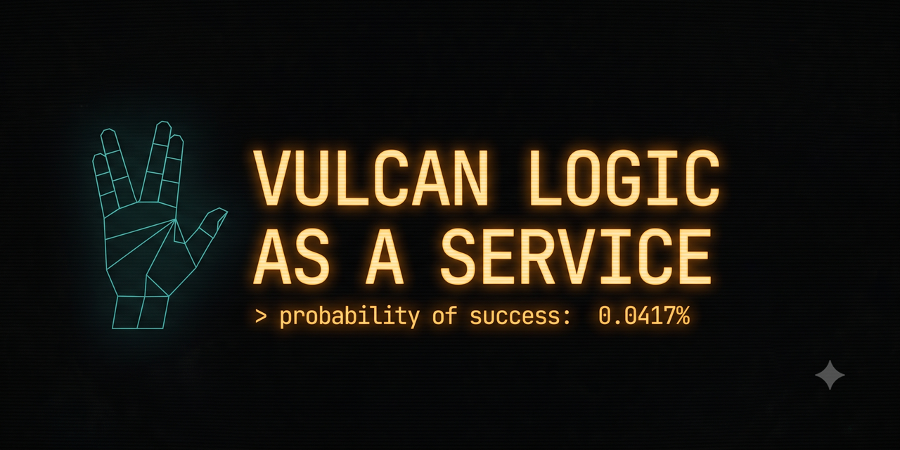

# Vulcan Logic as a Service 🖖

> *Spock as a Service* — a free joke API that returns original Vulcan-style logic pronouncements, in the spirit of No-as-a-Service.

**Coming soon.** Full documentation, live endpoint, curl examples, and integration guides will be available at v1.0 launch.

---

*This is an unofficial fan project created as a parody/homage. It is not affiliated with, endorsed by, or connected to Paramount Global, CBS Studios, or any rights holders of the Star Trek franchise. All phrases are entirely original writing; no scripted Star Trek dialogue has been used or paraphrased. "Star Trek" and related marks are trademarks of Paramount. This project is non-commercial and intended solely for humor and developer joy.*
